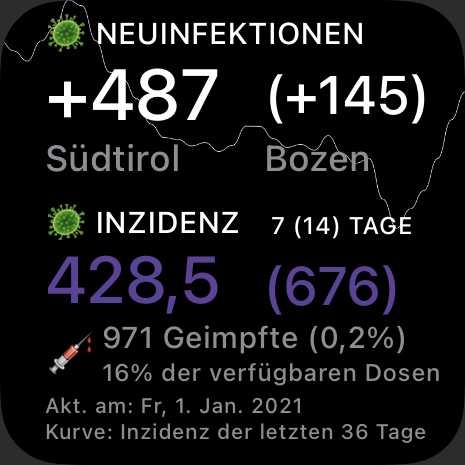

# covid-southtyrol-widget
A Scriptable Widget for Covid statistics of South Tyrol

**Installation:** 
- Install Scriptable: https://apps.apple.com/dk/app/scriptable/id1405459188
- Two ways to get the script:
  - One tap installation via ScriptDude: [link](https://scriptdu.de/?name=South+Tyrol+Corona+Widget&source=https%3A%2F%2Fraw.githubusercontent.com%2Fjrkager%2Fcovid-southtyrol-widget%2Fmain%2Fwidget.js&docs=https%3A%2F%2Fgithub.com%2Fjrkager%2Fcovid-southtyrol-widget%2Fblob%2Fmain%2FREADME.md)
  - Copy Javascript Code from [widget.js](https://raw.githubusercontent.com/jrkager/covid-southtyrol-widget/main/widget.js) and paste it into a new Scriptable script
- On the homescreen long press anywhere to start the "wiggle mode"
- Top left press the "+"-symbol, then scroll down to "Scriptable", choose the first widget size (small) and add widget
- While in Wiggle Mode press on the new widget to see its settings
- Under "Script" choose the one you just created

**Local data**:  
The script checks your GPS coordinates and maps it to the municipality (Gemeinde). The location-specific data will be displayed in brackets.   
You can **disable local data** by setting _const showLocalData = false;_ in the script code (line 12 or 13).

 
    

